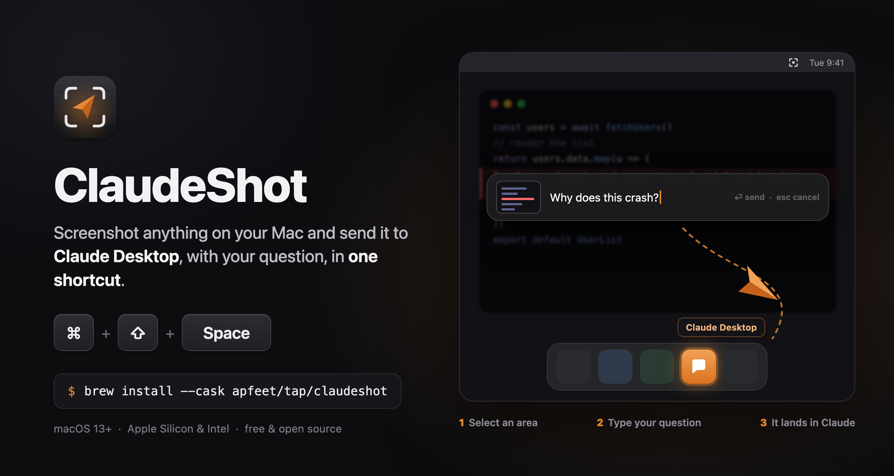

<p align="center">
  
</p>

<p align="center">
  <a href="https://github.com/apfeet/ClaudeShot/releases/latest"></a>
  
  
  <a href="LICENSE"></a>
</p>

# ClaudeShot

**Ask Claude about anything on your screen, without leaving what you're doing.**

Press <kbd>⌘</kbd> <kbd>⇧</kbd> <kbd>Space</kbd>, drag over the part of the screen you care about, type your question, hit <kbd>⏎</kbd>. ClaudeShot opens Claude Desktop and drops the screenshot and your question straight into the chat.

No saving files, no dragging images around, no window juggling.

## Install

With [Homebrew](https://brew.sh):

```bash
brew install --cask apfeet/tap/claudeshot
```

Or download `ClaudeShot-1.0.0.zip` from the [latest release](https://github.com/apfeet/ClaudeShot/releases/latest), unzip it and move `ClaudeShot.app` to `/Applications`.

ClaudeShot is free and not notarized by Apple, so the **first time** you open it (whichever way you installed it) macOS blocks it. Go to **System Settings → Privacy & Security**, scroll down and click **Open Anyway**. Or, in Terminal:

```bash
xattr -dr com.apple.quarantine /Applications/ClaudeShot.app
```

**You also need [Claude Desktop](https://claude.ai/download)** installed.

## First launch

ClaudeShot lives in the menu bar (the viewfinder icon). It has no Dock icon and no windows of its own.

macOS asks for two permissions, once. Grant both in **System Settings → Privacy & Security**:

| Permission | Why |
|---|---|
| **Accessibility** | to paste the screenshot and type your question into Claude Desktop |
| **Screen & System Audio Recording** | to take the screenshot of the area you select |

If the shortcut doesn't paste anything, check that ClaudeShot is ticked in both lists, then quit and reopen it from the menu bar icon.

## How to use it

1. Press <kbd>⌘</kbd> <kbd>⇧</kbd> <kbd>Space</kbd> anywhere (or choose **Capture → Claude** from the menu bar icon).
2. Drag over an area of the screen. Press <kbd>Space</kbd> while selecting to capture a whole window, <kbd>Esc</kbd> to give up.
3. The screen dims and a prompt bar appears with a preview of your screenshot. Type a question, or leave it empty.
4. Press <kbd>⏎</kbd> to send, <kbd>Esc</kbd> (or a click outside) to cancel.

The screenshot flies off as a paper plane, Claude Desktop comes to the front, and the image and your text are already in the message box. Press <kbd>⏎</kbd> there to send it to Claude.

The interface is in English, or in Italian if your Mac is set to Italian.

## How it works

ClaudeShot is a single Swift file using AppKit, no dependencies.

- The global shortcut is a Carbon hot key, so it works from any app.
- The capture is macOS's own `screencapture -i -c`: the same selection tool as <kbd>⌘</kbd> <kbd>⇧</kbd> <kbd>4</kbd>, with the result placed on the clipboard.
- On <kbd>⏎</kbd> it activates Claude Desktop (`com.anthropic.claudefordesktop`), sends it <kbd>⌘</kbd> <kbd>V</kbd> and types your text, through the Accessibility API.

Nothing is uploaded anywhere by ClaudeShot. The screenshot goes from your clipboard into Claude Desktop, and what happens after you press send is between you and Claude. Note that it **replaces whatever was on your clipboard** with the screenshot.

## Build from source

You need Xcode 15 or later.

```bash
git clone https://github.com/apfeet/ClaudeShot.git
cd ClaudeShot
./build.sh        # builds, installs in /Applications and launches it
./release.sh      # universal build zipped in dist/, with its SHA-256
```

`build.sh` signs ad-hoc by default, which makes macOS ask for the Accessibility permission again after every rebuild. To avoid that, sign with your own certificate:

```bash
SIGN_IDENTITY="Apple Development: you@example.com (TEAMID)" ./build.sh
```

or put that line in a `.signing.local` file next to the script (it is ignored by git).

## Uninstall

```bash
brew uninstall --cask claudeshot
```

or quit it from the menu bar and delete `/Applications/ClaudeShot.app`. You can also remove it from the two Privacy & Security lists.

## Disclaimer

ClaudeShot is an independent project. It is not affiliated with, endorsed by or sponsored by Anthropic. "Claude" is a trademark of Anthropic, PBC.

## License

[MIT](LICENSE)
